# Diagramas de Arquitetura Detalhados - AppFlowy-Cloud AWS

## 📋 Índice

1. [Arquitetura de Rede Completa](#arquitetura-de-rede-completa)
2. [Distribuição de Recursos por AZ](#distribuição-de-recursos-por-az)
3. [Fluxo de Dados Detalhado](#fluxo-de-dados-detalhado)
4. [Arquitetura de Segurança](#arquitetura-de-segurança)
5. [Monitoramento e Observabilidade](#monitoramento-e-observabilidade)
6. [Disaster Recovery](#disaster-recovery)

## 🌐 Arquitetura de Rede Completa

### VPC e Subnets Detalhadas

```mermaid
graph TB
    subgraph "VPC: 10.0.0.0/16 - AppFlowy Production"
        subgraph "Public Subnets"
            subgraph "us-east-1a (10.0.1.0/24)"
                ALB1[Application Load Balancer<br/>10.0.1.10]
                NAT1[NAT Gateway<br/>10.0.1.20]
                BASTION1[Bastion Host<br/>10.0.1.30]
            end
            subgraph "us-east-1b (10.0.2.0/24)"
                ALB2[Application Load Balancer<br/>10.0.2.10]
                NAT2[NAT Gateway<br/>10.0.2.20]
                BASTION2[Bastion Host<br/>10.0.2.30]
            end
        end
        
        subgraph "Private Subnets - Application"
            subgraph "us-east-1a (10.0.10.0/24)"
                ECS1[ECS Tasks<br/>10.0.10.10-50]
                ECS2[ECS Tasks<br/>10.0.10.51-100]
                ECS3[ECS Tasks<br/>10.0.10.101-150]
            end
            subgraph "us-east-1b (10.0.11.0/24)"
                ECS4[ECS Tasks<br/>10.0.11.10-50]
                ECS5[ECS Tasks<br/>10.0.11.51-100]
                ECS6[ECS Tasks<br/>10.0.11.101-150]
            end
        end
        
        subgraph "Private Subnets - Database"
            subgraph "us-east-1a (10.0.20.0/24)"
                RDS1[RDS Primary<br/>10.0.20.10]
                RDS2[RDS Read Replica<br/>10.0.20.20]
            end
            subgraph "us-east-1b (10.0.21.0/24)"
                RDS3[RDS Read Replica<br/>10.0.21.10]
                RDS4[RDS Read Replica<br/>10.0.21.20]
            end
        end
        
        subgraph "Private Subnets - Cache"
            subgraph "us-east-1a (10.0.30.0/24)"
                REDIS1[ElastiCache Primary<br/>10.0.30.10]
                REDIS2[ElastiCache Replica<br/>10.0.30.20]
            end
            subgraph "us-east-1b (10.0.31.0/24)"
                REDIS3[ElastiCache Replica<br/>10.0.31.10]
                REDIS4[ElastiCache Replica<br/>10.0.31.20]
            end
        end
    end
    
    subgraph "Internet Gateway"
        IGW[Internet Gateway<br/>igw-12345678]
    end
    
    subgraph "Route Tables"
        RT_PUBLIC[Public Route Table<br/>0.0.0.0/0 → IGW]
        RT_PRIVATE_A[Private Route Table A<br/>0.0.0.0/0 → NAT1]
        RT_PRIVATE_B[Private Route Table B<br/>0.0.0.0/0 → NAT2]
    end
    
    IGW --> ALB1
    IGW --> ALB2
    IGW --> NAT1
    IGW --> NAT2
    
    ALB1 --> ECS1
    ALB1 --> ECS2
    ALB1 --> ECS3
    ALB2 --> ECS4
    ALB2 --> ECS5
    ALB2 --> ECS6
    
    ECS1 --> RDS1
    ECS2 --> RDS1
    ECS3 --> RDS1
    ECS4 --> RDS1
    ECS5 --> RDS1
    ECS6 --> RDS1
    
    ECS1 --> REDIS1
    ECS2 --> REDIS1
    ECS3 --> REDIS1
    ECS4 --> REDIS1
    ECS5 --> REDIS1
    ECS6 --> REDIS1
```



## 🏗️ Distribuição de Recursos por AZ

### Especificações Detalhadas por Availability Zone


## 🔄 Fluxo de Dados Detalhado

### Arquitetura de Dados e Comunicação


## 🔒 Arquitetura de Segurança

### Security Groups e IAM Policies


## 📊 Monitoramento e Observabilidade

### CloudWatch Dashboard e Métricas

```mermaid
graph TB
    subgraph "CloudWatch Dashboard"
        subgraph "ECS Metrics"
            ECS_CPU[CPU Utilization<br/>Target: <70%<br/>Alarm: >85%]
            ECS_MEMORY[Memory Utilization<br/>Target: <80%<br/>Alarm: >90%]
            ECS_RUNNING[Running Tasks<br/>Expected: 10<br/>Alarm: <8]
        end
        
        subgraph "RDS Metrics"
            RDS_CPU[CPU Utilization<br/>Target: <60%<br/>Alarm: >80%]
            RDS_CONNECTIONS[Database Connections<br/>Target: <150<br/>Alarm: >180]
            RDS_MEMORY[Freeable Memory<br/>Target: >8GB<br/>Alarm: <4GB]
            RDS_IOPS[IOPS<br/>Target: <3000<br/>Alarm: >5000]
        end
        
        subgraph "ElastiCache Metrics"
            REDIS_CPU[CPU Utilization<br/>Target: <50%<br/>Alarm: >70%]
            REDIS_MEMORY[Memory Usage<br/>Target: <80%<br/>Alarm: >90%]
            REDIS_CONNECTIONS[Connections<br/>Target: <1000<br/>Alarm: >1200]
            REDIS_HIT_RATIO[Cache Hit Ratio<br/>Target: >90%<br/>Alarm: <80%]
        end
        
        subgraph "S3 Metrics"
            S3_SIZE[Bucket Size<br/>Current: 500GB<br/>Alarm: >1TB]
            S3_OBJECTS[Number of Objects<br/>Current: 1M<br/>Alarm: >5M]
            S3_REQUESTS[Request Count<br/>Target: <10K/min<br/>Alarm: >20K/min]
        end
    end
    
    subgraph "CloudWatch Alarms"
        subgraph "Critical Alarms"
            CRITICAL_CPU[ECS CPU >85%<br/>SNS: Critical Alerts]
            CRITICAL_DB[RDS Connections >180<br/>SNS: Critical Alerts]
            CRITICAL_REDIS[Redis Memory >90%<br/>SNS: Critical Alerts]
        end
        
        subgraph "Warning Alarms"
            WARNING_CPU[ECS CPU >70%<br/>SNS: Warning Alerts]
            WARNING_DB[RDS CPU >60%<br/>SNS: Warning Alerts]
            WARNING_REDIS[Redis CPU >50%<br/>SNS: Warning Alerts]
        end
    end
    
    subgraph "X-Ray Tracing"
        XRAY[X-Ray Service Map]
        API_TRACE[API Request Tracing]
        DB_TRACE[Database Query Tracing]
        CACHE_TRACE[Cache Operation Tracing]
    end
    
    subgraph "Log Groups"
        ECS_LOGS[/ecs/appflowy-cloud<br/>Retention: 30 days]
        RDS_LOGS[/aws/rds/instance/production-appflowy-db<br/>Retention: 7 days]
        ALB_LOGS[/aws/applicationloadbalancer/production-alb<br/>Retention: 30 days]
    end
    
    ECS_CPU --> CRITICAL_CPU
    ECS_CPU --> WARNING_CPU
    RDS_CONNECTIONS --> CRITICAL_DB
    RDS_CPU --> WARNING_DB
    REDIS_MEMORY --> CRITICAL_REDIS
    REDIS_CPU --> WARNING_REDIS
    
    API_TRACE --> XRAY
    DB_TRACE --> XRAY
    CACHE_TRACE --> XRAY
```

## 🔄 Disaster Recovery

### Multi-Region Setup


## 📈 Auto Scaling Configuration

### Scaling Policies e Thresholds


## 💰 Custos por Componente

### Breakdown Detalhado de Custos


---

**Nota**: Estes diagramas fornecem uma visão detalhada e específica da arquitetura AWS para o AppFlowy-Cloud, incluindo especificações exatas de recursos, distribuição geográfica, fluxos de dados e configurações de segurança. Use-os como referência para implementação e manutenção da infraestrutura.
