# AppFlowy-Cloud AWS Infrastructure Guide

## 📋 Índice

1. [Visão Geral da Arquitetura](#visão-geral-da-arquitetura)
2. [Componentes da Solução](#componentes-da-solução)
3. [Arquitetura AWS Proposta](#arquitetura-aws-proposta)
4. [Serviços AWS Recomendados](#serviços-aws-recomendados)
5. [Especificações Detalhadas de Recursos](#especificações-detalhadas-de-recursos)
6. [Diagramas de Arquitetura](#diagramas-de-arquitetura)
7. [Configuração e Deploy](#configuração-e-deploy)
8. [Monitoramento e Observabilidade](#monitoramento-e-observabilidade)
9. [Segurança](#segurança)
10. [Custos Estimados](#custos-estimados)
11. [Considerações de Escalabilidade](#considerações-de-escalabilidade)

## 🏗️ Visão Geral da Arquitetura

O AppFlowy-Cloud é uma plataforma de colaboração em tempo real escrita em Rust, composta por múltiplos microserviços que trabalham em conjunto para fornecer:

- **Autenticação e Autorização** (GoTrue)
- **API Principal** (AppFlowy Cloud)
- **Serviços de Colaboração** (WebSocket/Real-time)
- **Processamento de Background** (Worker Services)
- **Capacidades de IA/ML** (OpenAI Integration)
- **Armazenamento de Arquivos** (S3/MinIO)
- **Interface de Administração** (Admin Frontend)
- **Interface Web** (AppFlowy Web)

## 🔧 Componentes da Solução

### Core Services

| Serviço | Tecnologia | Função | Porta |
|---------|------------|--------|-------|
| **appflowy_cloud** | Rust (Actix-web) | API principal, gerenciamento de workspaces | 8000 |
| **gotrue** | Go | Autenticação, OAuth, JWT | 9999 |
| **appflowy_collaborate** | Rust | Colaboração em tempo real, WebSocket | 8001 |
| **appflowy_worker** | Rust | Processamento assíncrono, importação | 4001 |
| **ai** | Python | Serviços de IA, embeddings, OpenAI | 5001 |
| **admin_frontend** | Rust (Askama) | Interface administrativa | 3000 |
| **appflowy_web** | React/TypeScript | Interface web principal | 3001 |

### Infrastructure Services

| Serviço | Tecnologia | Função | Porta |
|---------|------------|--------|-------|
| **postgres** | PostgreSQL + pgvector | Banco de dados principal | 5432 |
| **redis** | Redis | Cache, sessões, filas | 6379 |
| **minio** | MinIO | Armazenamento S3-compatible | 9000 |
| **nginx** | Nginx | Reverse proxy, load balancer | 80/443 |

## ☁️ Arquitetura AWS Proposta

### Estratégia de Migração

A migração para AWS envolve substituir componentes locais por serviços AWS equivalentes:

1. **MinIO → Amazon S3**: Armazenamento de objetos
2. **PostgreSQL → Amazon RDS**: Banco de dados gerenciado
3. **Redis → Amazon ElastiCache**: Cache distribuído
4. **OpenAI → Amazon Bedrock**: Serviços de IA
5. **Nginx → Application Load Balancer**: Load balancing
6. **Docker Compose → Amazon ECS**: Orquestração de containers

## 🚀 Serviços AWS Recomendados

### Compute & Container
- **Amazon ECS (Fargate)**: Orquestração de containers sem servidor
- **Amazon ECR**: Registry de containers Docker
- **AWS Lambda**: Funções serverless para processamento leve

### Database & Storage
- **Amazon RDS PostgreSQL**: Banco de dados principal com pgvector
- **Amazon ElastiCache Redis**: Cache e sessões
- **Amazon S3**: Armazenamento de arquivos
- **Amazon S3 Glacier**: Backup de longo prazo

### AI/ML Services
- **Amazon Bedrock**: Serviços de IA (substitui OpenAI)
- **Amazon OpenSearch**: Busca semântica e embeddings
- **Amazon SageMaker**: Modelos customizados (opcional)

### Networking & Security
- **Amazon VPC**: Rede privada isolada
- **Application Load Balancer**: Load balancing e SSL termination
- **Amazon Route 53**: DNS e health checks
- **AWS Certificate Manager**: Certificados SSL/TLS
- **AWS Secrets Manager**: Gerenciamento de secrets
- **AWS IAM**: Controle de acesso

### Monitoring & Observability
- **Amazon CloudWatch**: Logs, métricas e alertas
- **AWS X-Ray**: Distributed tracing
- **Amazon CloudTrail**: Auditoria de API calls

## 📊 Diagramas de Arquitetura

### Arquitetura Atual (Docker Compose)


### Arquitetura AWS Proposta


### Arquitetura de Rede VPC


## 🔧 Especificações Detalhadas de Recursos

### 📊 Dimensionamento por Ambiente

#### Ambiente de Produção (High Traffic)

| Componente | Especificação | Quantidade | Justificativa |
|------------|---------------|------------|---------------|
| **ECS Fargate Tasks** | 2 vCPU, 4GB RAM | 6 tasks (2 por AZ) | Alta disponibilidade e performance |
| **RDS PostgreSQL** | db.r6g.xlarge | 1 primary + 1 read replica | Suporte a pgvector + alta performance |
| **ElastiCache Redis** | cache.r6g.large | 1 primary + 1 replica | Cache distribuído + failover |
| **S3 Storage** | Standard + IA | 500GB inicial | Armazenamento escalável |
| **Application Load Balancer** | Standard | 1 (multi-AZ) | Load balancing + SSL termination |
| **CloudWatch Logs** | Standard | 30 dias retenção | Compliance e debugging |

#### Ambiente de Staging

| Componente | Especificação | Quantidade | Justificativa |
|------------|---------------|------------|---------------|
| **ECS Fargate Tasks** | 1 vCPU, 2GB RAM | 2 tasks | Testes e validação |
| **RDS PostgreSQL** | db.r6g.large | 1 instance | Desenvolvimento e testes |
| **ElastiCache Redis** | cache.r6g.small | 1 instance | Cache para testes |
| **S3 Storage** | Standard | 100GB | Dados de teste |
| **Application Load Balancer** | Standard | 1 | Load balancing básico |

#### Ambiente de Desenvolvimento

| Componente | Especificação | Quantidade | Justificativa |
|------------|---------------|------------|---------------|
| **ECS Fargate Tasks** | 0.5 vCPU, 1GB RAM | 1 task | Desenvolvimento local |
| **RDS PostgreSQL** | db.t3.micro | 1 instance | Desenvolvimento |
| **ElastiCache Redis** | cache.t3.micro | 1 instance | Cache local |
| **S3 Storage** | Standard | 50GB | Dados de desenvolvimento |

### 🏗️ Arquitetura Detalhada por Serviço

#### 1. ECS Fargate - Distribuição de Containers


#### 2. RDS PostgreSQL - Especificações Detalhadas


#### 3. ElastiCache Redis - Configuração de Cache


#### 4. S3 Storage - Estrutura de Buckets

```mermaid
graph TB
    subgraph "S3 Storage Architecture"
        subgraph "Main Bucket"
            BUCKET[appflowy-production-storage<br/>500GB Total Storage]
        end
        
        subgraph "Storage Classes"
            STANDARD[Standard Storage<br/>Frequently accessed files<br/>~300GB]
            IA[Infrequent Access<br/>Older documents<br/>~150GB]
            GLACIER[Glacier Storage<br/>Archived data<br/>~50GB]
        end
        
        subgraph "Lifecycle Rules"
            RULE1[30 days → IA<br/>90 days → Glacier<br/>365 days → Deep Archive]
        end
        
        subgraph "Security"
            ENCRYPTION[AES-256 Encryption<br/>Bucket Policies<br/>Access Logging]
        end
    end
    
    BUCKET --> STANDARD
    BUCKET --> IA
    BUCKET --> GLACIER
    BUCKET --> RULE1
    BUCKET --> ENCRYPTION
```



### 📈 Auto Scaling Configuration

#### ECS Auto Scaling Policies

```hcl
# CPU-based Auto Scaling
resource "aws_appautoscaling_policy" "cpu_scaling" {
  name               = "appflowy-cpu-scaling"
  policy_type        = "TargetTrackingScaling"
  resource_id        = aws_appautoscaling_target.ecs_target.resource_id
  scalable_dimension = aws_appautoscaling_target.ecs_target.scalable_dimension
  service_namespace  = aws_appautoscaling_target.ecs_target.service_namespace

  target_tracking_scaling_policy_configuration {
    predefined_metric_specification {
      predefined_metric_type = "ECSServiceAverageCPUUtilization"
    }
    target_value = 70.0
    scale_in_cooldown  = 300
    scale_out_cooldown = 300
  }
}

# Memory-based Auto Scaling
resource "aws_appautoscaling_policy" "memory_scaling" {
  name               = "appflowy-memory-scaling"
  policy_type        = "TargetTrackingScaling"
  resource_id        = aws_appautoscaling_target.ecs_target.resource_id
  scalable_dimension = aws_appautoscaling_target.ecs_target.scalable_dimension
  service_namespace  = aws_appautoscaling_target.ecs_target.service_namespace

  target_tracking_scaling_policy_configuration {
    predefined_metric_specification {
      predefined_metric_type = "ECSServiceAverageMemoryUtilization"
    }
    target_value = 80.0
    scale_in_cooldown  = 300
    scale_out_cooldown = 300
  }
}
```

#### RDS Auto Scaling

```hcl
# RDS Storage Auto Scaling
resource "aws_db_instance" "main" {
  # ... other configurations ...
  
  allocated_storage     = 100
  max_allocated_storage = 1000
  storage_encrypted     = true
  storage_type          = "gp3"
  
  # Performance Insights
  performance_insights_enabled = true
  performance_insights_retention_period = 7
  
  # Monitoring
  monitoring_interval = 60
  monitoring_role_arn = aws_iam_role.rds_monitoring.arn
}
```

### 🔄 Disaster Recovery Setup

#### Multi-Region Architecture


### 📊 Resource Monitoring Dashboard

#### CloudWatch Dashboard Configuration

```json
{
  "widgets": [
    {
      "type": "metric",
      "properties": {
        "metrics": [
          ["AWS/ECS", "CPUUtilization", "ServiceName", "appflowy-cloud", "ClusterName", "production-appflowy-cluster"],
          ["AWS/ECS", "MemoryUtilization", "ServiceName", "appflowy-cloud", "ClusterName", "production-appflowy-cluster"]
        ],
        "period": 300,
        "stat": "Average",
        "region": "us-east-1",
        "title": "ECS Service Performance",
        "yAxis": {
          "left": {
            "min": 0,
            "max": 100
          }
        }
      }
    },
    {
      "type": "metric",
      "properties": {
        "metrics": [
          ["AWS/RDS", "CPUUtilization", "DBInstanceIdentifier", "production-appflowy-db"],
          ["AWS/RDS", "DatabaseConnections", "DBInstanceIdentifier", "production-appflowy-db"],
          ["AWS/RDS", "FreeableMemory", "DBInstanceIdentifier", "production-appflowy-db"]
        ],
        "period": 300,
        "stat": "Average",
        "region": "us-east-1",
        "title": "RDS Performance Metrics"
      }
    },
    {
      "type": "metric",
      "properties": {
        "metrics": [
          ["AWS/ElastiCache", "CPUUtilization", "CacheClusterId", "production-appflowy-cache"],
          ["AWS/ElastiCache", "DatabaseMemoryUsagePercentage", "CacheClusterId", "production-appflowy-cache"],
          ["AWS/ElastiCache", "CurrConnections", "CacheClusterId", "production-appflowy-cache"]
        ],
        "period": 300,
        "stat": "Average",
        "region": "us-east-1",
        "title": "ElastiCache Performance"
      }
    },
    {
      "type": "metric",
      "properties": {
        "metrics": [
          ["AWS/S3", "NumberOfObjects", "BucketName", "appflowy-production-storage"],
          ["AWS/S3", "BucketSizeBytes", "BucketName", "appflowy-production-storage", "StorageType", "StandardStorage"]
        ],
        "period": 86400,
        "stat": "Average",
        "region": "us-east-1",
        "title": "S3 Storage Usage"
      }
    }
  ]
}
```

### 🚨 Alertas e Notificações

#### CloudWatch Alarms Configuration

```bash
# ECS CPU High Alert
aws cloudwatch put-metric-alarm \
  --alarm-name "appflowy-ecs-cpu-critical" \
  --alarm-description "ECS CPU utilization is critically high" \
  --metric-name "CPUUtilization" \
  --namespace "AWS/ECS" \
  --statistic "Average" \
  --period 300 \
  --threshold 85 \
  --comparison-operator "GreaterThanThreshold" \
  --evaluation-periods 2 \
  --alarm-actions "arn:aws:sns:us-east-1:123456789012:appflowy-critical-alerts"

# RDS Connections High Alert
aws cloudwatch put-metric-alarm \
  --alarm-name "appflowy-rds-connections-critical" \
  --alarm-description "RDS connections are critically high" \
  --metric-name "DatabaseConnections" \
  --namespace "AWS/RDS" \
  --statistic "Average" \
  --period 300 \
  --threshold 80 \
  --comparison-operator "GreaterThanThreshold" \
  --evaluation-periods 2 \
  --alarm-actions "arn:aws:sns:us-east-1:123456789012:appflowy-critical-alerts"

# ElastiCache Memory High Alert
aws cloudwatch put-metric-alarm \
  --alarm-name "appflowy-redis-memory-critical" \
  --alarm-description "Redis memory usage is critically high" \
  --metric-name "DatabaseMemoryUsagePercentage" \
  --namespace "AWS/ElastiCache" \
  --statistic "Average" \
  --period 300 \
  --threshold 85 \
  --comparison-operator "GreaterThanThreshold" \
  --evaluation-periods 2 \
  --alarm-actions "arn:aws:sns:us-east-1:123456789012:appflowy-critical-alerts"
```

### 💰 Custos Detalhados por Recursos

#### Breakdown Mensal (Produção)

| Serviço | Especificação | Quantidade | Custo Unitário | Custo Mensal |
|---------|---------------|------------|----------------|--------------|
| **ECS Fargate** | 2 vCPU, 4GB RAM | 6 tasks | $30/mês | $180 |
| **ECS Fargate** | 1 vCPU, 2GB RAM | 4 tasks | $15/mês | $60 |
| **ECS Fargate** | 0.5 vCPU, 1GB RAM | 2 tasks | $7.50/mês | $15 |
| **RDS PostgreSQL** | db.r6g.xlarge | 1 primary | $120/mês | $120 |
| **RDS PostgreSQL** | db.r6g.large | 1 read replica | $60/mês | $60 |
| **ElastiCache Redis** | cache.r6g.large | 2 nodes | $30/mês | $60 |
| **S3 Storage** | 500GB + requests | 1 bucket | $5/mês | $5 |
| **Application Load Balancer** | 2 AZs | 1 ALB | $25/mês | $25 |
| **CloudWatch** | Logs + Metrics | Standard | $15/mês | $15 |
| **Bedrock** | 1M tokens/month | Standard | $10/mês | $10 |
| **Data Transfer** | 100GB/month | Outbound | $10/mês | $10 |
| **Route 53** | Hosted zone + queries | Standard | $5/mês | $5 |
| **Secrets Manager** | 4 secrets | Standard | $8/mês | $8 |
| **NAT Gateway** | 2 AZs | 2 NATs | $45/mês | $90 |
| **Total Estimado** | | | | **$663** |

#### Otimizações com Reserved Instances

| Otimização | Economia | Custo Otimizado |
|------------|----------|-----------------|
| **RDS Reserved (1 year)** | 30% | -$54 |
| **ElastiCache Reserved (1 year)** | 30% | -$18 |
| **Spot Instances (Worker tasks)** | 70% | -$10 |
| **S3 Lifecycle Optimization** | 50% | -$2.50 |
| **Total com Otimizações** | | **$578.50** |

### 🔧 Configurações de Performance

#### ECS Task Definitions - Especificações Detalhadas

```json
{
  "family": "appflowy-cloud",
  "networkMode": "awsvpc",
  "requiresCompatibilities": ["FARGATE"],
  "cpu": "2048",
  "memory": "4096",
  "executionRoleArn": "arn:aws:iam::123456789012:role/ecsTaskExecutionRole",
  "taskRoleArn": "arn:aws:iam::123456789012:role/appflowy-task-role",
  "containerDefinitions": [
    {
      "name": "appflowy-cloud",
      "image": "123456789012.dkr.ecr.us-east-1.amazonaws.com/appflowy-cloud:latest",
      "portMappings": [
        {
          "containerPort": 8000,
          "protocol": "tcp"
        }
      ],
      "environment": [
        {
          "name": "APPFLOWY_ENVIRONMENT",
          "value": "production"
        },
        {
          "name": "RUST_LOG",
          "value": "info"
        },
        {
          "name": "APPFLOWY_DATABASE_MAX_CONNECTIONS",
          "value": "40"
        },
        {
          "name": "APPFLOWY_WEBSOCKET_MAILBOX_SIZE",
          "value": "6000"
        }
      ],
      "secrets": [
        {
          "name": "APPFLOWY_DATABASE_URL",
          "valueFrom": "arn:aws:secretsmanager:us-east-1:123456789012:secret:appflowy/production/database:url::"
        },
        {
          "name": "APPFLOWY_REDIS_URI",
          "valueFrom": "arn:aws:secretsmanager:us-east-1:123456789012:secret:appflowy/production/redis:uri::"
        }
      ],
      "logConfiguration": {
        "logDriver": "awslogs",
        "options": {
          "awslogs-group": "/ecs/appflowy-cloud",
          "awslogs-region": "us-east-1",
          "awslogs-stream-prefix": "ecs"
        }
      },
      "healthCheck": {
        "command": ["CMD-SHELL", "curl -f http://localhost:8000/health || exit 1"],
        "interval": 30,
        "timeout": 5,
        "retries": 3,
        "startPeriod": 60
      },
      "ulimits": [
        {
          "name": "nofile",
          "softLimit": 65536,
          "hardLimit": 65536
        }
      ]
    }
  ]
}
```

#### RDS Parameter Group - Otimizações

```sql
-- PostgreSQL Parameter Group Optimizations
shared_preload_libraries = 'vector,pg_stat_statements'
max_connections = 200
shared_buffers = 8GB
effective_cache_size = 24GB
work_mem = 16MB
maintenance_work_mem = 1GB
checkpoint_completion_target = 0.9
wal_buffers = 16MB
default_statistics_target = 100
random_page_cost = 1.1
effective_io_concurrency = 200
```

#### ElastiCache Parameter Group - Otimizações

```bash
# Redis Parameter Group Optimizations
maxmemory-policy = allkeys-lru
maxmemory = 14GB
timeout = 300
tcp-keepalive = 60
tcp-backlog = 511
databases = 16
save = "900 1 300 10 60 10000"
stop-writes-on-bgsave-error = yes
rdbcompression = yes
rdbchecksum = yes
```

## ⚙️ Configuração e Deploy

### 1. Preparação da Infraestrutura

#### Terraform Configuration

```hcl
# main.tf
terraform {
  required_version = ">= 1.0"
  required_providers {
    aws = {
      source  = "hashicorp/aws"
      version = "~> 5.0"
    }
  }
}

provider "aws" {
  region = var.aws_region
}

# VPC e Networking
module "vpc" {
  source = "./modules/vpc"
  
  vpc_cidr             = "10.0.0.0/16"
  environment          = var.environment
  availability_zones   = ["us-east-1a", "us-east-1b"]
  private_subnets      = ["10.0.10.0/24", "10.0.11.0/24"]
  public_subnets       = ["10.0.1.0/24", "10.0.2.0/24"]
  database_subnets     = ["10.0.20.0/24", "10.0.21.0/24"]
  cache_subnets        = ["10.0.30.0/24", "10.0.31.0/24"]
}

# RDS PostgreSQL
module "rds" {
  source = "./modules/rds"
  
  vpc_id              = module.vpc.vpc_id
  subnet_ids          = module.vpc.database_subnet_ids
  security_group_ids  = [module.vpc.database_security_group_id]
  
  instance_class      = "db.r6g.large"
  allocated_storage   = 100
  storage_type        = "gp3"
  
  database_name       = "appflowy"
  master_username     = "postgres"
  master_password     = var.database_password
  
  backup_retention_period = 7
  backup_window          = "03:00-04:00"
  maintenance_window     = "sun:04:00-sun:05:00"
}

# ElastiCache Redis
module "elasticache" {
  source = "./modules/elasticache"
  
  vpc_id              = module.vpc.vpc_id
  subnet_ids          = module.vpc.cache_subnet_ids
  security_group_ids  = [module.vpc.cache_security_group_id]
  
  node_type           = "cache.r6g.large"
  num_cache_nodes     = 1
  parameter_group_name = "default.redis7"
}

# S3 Bucket
module "s3" {
  source = "./modules/s3"
  
  bucket_name         = "${var.environment}-appflowy-storage"
  environment         = var.environment
  
  versioning_enabled  = true
  lifecycle_rules     = [
    {
      id      = "glacier_transition"
      enabled = true
      transitions = [
        {
          days          = 90
          storage_class = "GLACIER"
        }
      ]
    }
  ]
}

# ECS Cluster
module "ecs" {
  source = "./modules/ecs"
  
  vpc_id              = module.vpc.vpc_id
  subnet_ids          = module.vpc.private_subnet_ids
  security_group_ids  = [module.vpc.ecs_security_group_id]
  
  cluster_name        = "${var.environment}-appflowy-cluster"
  environment         = var.environment
  
  appflowy_image      = var.appflowy_image
  gotrue_image        = var.gotrue_image
  ai_image           = var.ai_image
}

# Application Load Balancer
module "alb" {
  source = "./modules/alb"
  
  vpc_id              = module.vpc.vpc_id
  subnet_ids          = module.vpc.public_subnet_ids
  security_group_ids  = [module.vpc.alb_security_group_id]
  
  name                = "${var.environment}-appflowy-alb"
  environment         = var.environment
  
  certificate_arn     = var.certificate_arn
  domain_name         = var.domain_name
}
```

### 2. Configuração de Environment Variables

#### AWS Secrets Manager Integration

```bash
# Criar secrets no AWS Secrets Manager
aws secretsmanager create-secret \
  --name "appflowy/production/database" \
  --description "AppFlowy database credentials" \
  --secret-string '{
    "username": "postgres",
    "password": "your-secure-password",
    "host": "your-rds-endpoint",
    "port": "5432",
    "database": "appflowy"
  }'

aws secretsmanager create-secret \
  --name "appflowy/production/redis" \
  --description "AppFlowy Redis credentials" \
  --secret-string '{
    "host": "your-elasticache-endpoint",
    "port": "6379"
  }'

aws secretsmanager create-secret \
  --name "appflowy/production/s3" \
  --description "AppFlowy S3 credentials" \
  --secret-string '{
    "access_key": "your-access-key",
    "secret_key": "your-secret-key",
    "bucket": "your-bucket-name",
    "region": "us-east-1"
  }'

aws secretsmanager create-secret \
  --name "appflowy/production/bedrock" \
  --description "AppFlowy Bedrock credentials" \
  --secret-string '{
    "access_key": "your-access-key",
    "secret_key": "your-secret-key",
    "region": "us-east-1"
  }'
```

#### ECS Task Definition

```json
{
  "family": "appflowy-cloud",
  "networkMode": "awsvpc",
  "requiresCompatibilities": ["FARGATE"],
  "cpu": "1024",
  "memory": "2048",
  "executionRoleArn": "arn:aws:iam::123456789012:role/ecsTaskExecutionRole",
  "taskRoleArn": "arn:aws:iam::123456789012:role/appflowy-task-role",
  "containerDefinitions": [
    {
      "name": "appflowy-cloud",
      "image": "123456789012.dkr.ecr.us-east-1.amazonaws.com/appflowy-cloud:latest",
      "portMappings": [
        {
          "containerPort": 8000,
          "protocol": "tcp"
        }
      ],
      "environment": [
        {
          "name": "APPFLOWY_ENVIRONMENT",
          "value": "production"
        },
        {
          "name": "RUST_LOG",
          "value": "info"
        }
      ],
      "secrets": [
        {
          "name": "APPFLOWY_DATABASE_URL",
          "valueFrom": "arn:aws:secretsmanager:us-east-1:123456789012:secret:appflowy/production/database:url::"
        },
        {
          "name": "APPFLOWY_REDIS_URI",
          "valueFrom": "arn:aws:secretsmanager:us-east-1:123456789012:secret:appflowy/production/redis:uri::"
        },
        {
          "name": "APPFLOWY_S3_ACCESS_KEY",
          "valueFrom": "arn:aws:secretsmanager:us-east-1:123456789012:secret:appflowy/production/s3:access_key::"
        },
        {
          "name": "APPFLOWY_S3_SECRET_KEY",
          "valueFrom": "arn:aws:secretsmanager:us-east-1:123456789012:secret:appflowy/production/s3:secret_key::"
        }
      ],
      "logConfiguration": {
        "logDriver": "awslogs",
        "options": {
          "awslogs-group": "/ecs/appflowy-cloud",
          "awslogs-region": "us-east-1",
          "awslogs-stream-prefix": "ecs"
        }
      },
      "healthCheck": {
        "command": ["CMD-SHELL", "curl -f http://localhost:8000/health || exit 1"],
        "interval": 30,
        "timeout": 5,
        "retries": 3,
        "startPeriod": 60
      }
    }
  ]
}
```

### 3. Migração do OpenAI para Amazon Bedrock

#### Configuração do Bedrock

```python
# ai_service_bedrock.py
import boto3
import json
from typing import List, Dict, Any

class BedrockService:
    def __init__(self, region_name: str = "us-east-1"):
        self.bedrock = boto3.client(
            service_name='bedrock-runtime',
            region_name=region_name
        )
        
    def generate_embeddings(self, text: str) -> List[float]:
        """Generate embeddings using Amazon Titan Embeddings"""
        request_body = {
            "inputText": text
        }
        
        response = self.bedrock.invoke_model(
            modelId="amazon.titan-embed-text-v1",
            body=json.dumps(request_body)
        )
        
        response_body = json.loads(response.get('body').read())
        return response_body['embedding']
    
    def generate_text(self, prompt: str, model_id: str = "anthropic.claude-3-sonnet-20240229-v1:0") -> str:
        """Generate text using Claude 3 Sonnet"""
        request_body = {
            "anthropic_version": "bedrock-2023-05-31",
            "max_tokens": 4096,
            "messages": [
                {
                    "role": "user",
                    "content": prompt
                }
            ]
        }
        
        response = self.bedrock.invoke_model(
            modelId=model_id,
            body=json.dumps(request_body)
        )
        
        response_body = json.loads(response.get('body').read())
        return response_body['content'][0]['text']
    
    def summarize_documents(self, question: str, documents: List[str]) -> str:
        """Summarize documents using Claude"""
        context = "\n\n".join(documents)
        prompt = f"""
        Based on the following context, answer the question: {question}
        
        Context:
        {context}
        
        Answer:
        """
        
        return self.generate_text(prompt)
```

#### Atualização das Configurações

```rust
// libs/indexer/src/vector/bedrock.rs
use aws_sdk_bedrockruntime::Client;
use serde_json::json;

pub struct BedrockEmbedder {
    client: Client,
}

impl BedrockEmbedder {
    pub fn new() -> Self {
        let config = aws_config::load_from_env();
        let client = Client::new(&config);
        
        Self { client }
    }
    
    pub async fn generate_embeddings(&self, text: &str) -> Result<Vec<f32>, AppError> {
        let request_body = json!({
            "inputText": text
        });
        
        let response = self.client
            .invoke_model()
            .model_id("amazon.titan-embed-text-v1")
            .body(aws_sdk_bedrockruntime::types::Blob::new(
                serde_json::to_string(&request_body)?
            ))
            .send()
            .await?;
        
        let response_body: serde_json::Value = serde_json::from_slice(
            &response.body.collect().await?.into_bytes()
        )?;
        
        let embedding: Vec<f32> = serde_json::from_value(
            response_body["embedding"].clone()
        )?;
        
        Ok(embedding)
    }
}
```

### 4. Pipeline de CI/CD

#### GitHub Actions Workflow

```yaml
# .github/workflows/deploy-aws.yml
name: Deploy to AWS

on:
  push:
    branches: [main]
  pull_request:
    branches: [main]

env:
  AWS_REGION: us-east-1
  ECR_REPOSITORY: appflowy-cloud
  ECS_CLUSTER: production-appflowy-cluster
  ECS_SERVICE: appflowy-cloud-service

jobs:
  test:
    runs-on: ubuntu-latest
    steps:
      - uses: actions/checkout@v4
      
      - name: Setup Rust
        uses: actions-rs/toolchain@v1
        with:
          toolchain: stable
          
      - name: Run tests
        run: cargo test --all
        
  build-and-push:
    needs: test
    runs-on: ubuntu-latest
    if: github.ref == 'refs/heads/main'
    
    steps:
      - uses: actions/checkout@v4
      
      - name: Configure AWS credentials
        uses: aws-actions/configure-aws-credentials@v4
        with:
          aws-access-key-id: ${{ secrets.AWS_ACCESS_KEY_ID }}
          aws-secret-access-key: ${{ secrets.AWS_SECRET_ACCESS_KEY }}
          aws-region: ${{ env.AWS_REGION }}
          
      - name: Login to Amazon ECR
        id: login-ecr
        uses: aws-actions/amazon-ecr-login@v2
        
      - name: Build and push Docker images
        env:
          ECR_REGISTRY: ${{ steps.login-ecr.outputs.registry }}
          IMAGE_TAG: ${{ github.sha }}
        run: |
          docker build -t $ECR_REGISTRY/$ECR_REPOSITORY:$IMAGE_TAG .
          docker push $ECR_REGISTRY/$ECR_REPOSITORY:$IMAGE_TAG
          docker tag $ECR_REGISTRY/$ECR_REPOSITORY:$IMAGE_TAG $ECR_REGISTRY/$ECR_REPOSITORY:latest
          docker push $ECR_REGISTRY/$ECR_REPOSITORY:latest
          
  deploy:
    needs: build-and-push
    runs-on: ubuntu-latest
    if: github.ref == 'refs/heads/main'
    
    steps:
      - uses: actions/checkout@v4
      
      - name: Configure AWS credentials
        uses: aws-actions/configure-aws-credentials@v4
        with:
          aws-access-key-id: ${{ secrets.AWS_ACCESS_KEY_ID }}
          aws-secret-access-key: ${{ secrets.AWS_SECRET_ACCESS_KEY }}
          aws-region: ${{ env.AWS_REGION }}
          
      - name: Update ECS service
        run: |
          aws ecs update-service \
            --cluster $ECS_CLUSTER \
            --service $ECS_SERVICE \
            --force-new-deployment
```

## 📊 Monitoramento e Observabilidade

### CloudWatch Dashboards

```json
{
  "widgets": [
    {
      "type": "metric",
      "properties": {
        "metrics": [
          ["AWS/ECS", "CPUUtilization", "ServiceName", "appflowy-cloud"],
          ["AWS/ECS", "MemoryUtilization", "ServiceName", "appflowy-cloud"]
        ],
        "period": 300,
        "stat": "Average",
        "region": "us-east-1",
        "title": "ECS Service Metrics"
      }
    },
    {
      "type": "metric",
      "properties": {
        "metrics": [
          ["AWS/RDS", "CPUUtilization", "DBInstanceIdentifier", "appflowy-db"],
          ["AWS/RDS", "DatabaseConnections", "DBInstanceIdentifier", "appflowy-db"]
        ],
        "period": 300,
        "stat": "Average",
        "region": "us-east-1",
        "title": "RDS Metrics"
      }
    },
    {
      "type": "metric",
      "properties": {
        "metrics": [
          ["AWS/ElastiCache", "CPUUtilization", "CacheClusterId", "appflowy-redis"],
          ["AWS/ElastiCache", "DatabaseMemoryUsagePercentage", "CacheClusterId", "appflowy-redis"]
        ],
        "period": 300,
        "stat": "Average",
        "region": "us-east-1",
        "title": "ElastiCache Metrics"
      }
    }
  ]
}
```

### CloudWatch Alarms

```bash
# CPU Utilization Alarm
aws cloudwatch put-metric-alarm \
  --alarm-name "appflowy-ecs-cpu-high" \
  --alarm-description "ECS CPU utilization is high" \
  --metric-name "CPUUtilization" \
  --namespace "AWS/ECS" \
  --statistic "Average" \
  --period 300 \
  --threshold 80 \
  --comparison-operator "GreaterThanThreshold" \
  --evaluation-periods 2 \
  --alarm-actions "arn:aws:sns:us-east-1:123456789012:appflowy-alerts"

# Database Connections Alarm
aws cloudwatch put-metric-alarm \
  --alarm-name "appflowy-rds-connections-high" \
  --alarm-description "RDS connections are high" \
  --metric-name "DatabaseConnections" \
  --namespace "AWS/RDS" \
  --statistic "Average" \
  --period 300 \
  --threshold 80 \
  --comparison-operator "GreaterThanThreshold" \
  --evaluation-periods 2 \
  --alarm-actions "arn:aws:sns:us-east-1:123456789012:appflowy-alerts"
```

### X-Ray Tracing

```rust
// Adicionar tracing distribuído
use aws_xray_sdk::core::aws_xray_trace_context_impl::TraceContextImpl;
use aws_xray_sdk::core::trace_context_entity::TraceContextEntity;
use aws_xray_sdk::core::trace_id_entity::TraceIdEntity;

#[instrument]
async fn handle_request(req: HttpRequest) -> Result<HttpResponse, AppError> {
    let trace_id = TraceIdEntity::new();
    let trace_context = TraceContextImpl::new(trace_id);
    
    // Sua lógica aqui
    Ok(HttpResponse::Ok().finish())
}
```

## 🔒 Segurança

### IAM Policies

```json
{
  "Version": "2012-10-17",
  "Statement": [
    {
      "Effect": "Allow",
      "Action": [
        "secretsmanager:GetSecretValue"
      ],
      "Resource": [
        "arn:aws:secretsmanager:us-east-1:123456789012:secret:appflowy/*"
      ]
    },
    {
      "Effect": "Allow",
      "Action": [
        "s3:GetObject",
        "s3:PutObject",
        "s3:DeleteObject"
      ],
      "Resource": [
        "arn:aws:s3:::production-appflowy-storage/*"
      ]
    },
    {
      "Effect": "Allow",
      "Action": [
        "bedrock:InvokeModel"
      ],
      "Resource": [
        "arn:aws:bedrock:us-east-1::foundation-model/amazon.titan-embed-text-v1",
        "arn:aws:bedrock:us-east-1::foundation-model/anthropic.claude-3-sonnet-20240229-v1:0"
      ]
    }
  ]
}
```

### Security Groups

```hcl
# ALB Security Group
resource "aws_security_group" "alb" {
  name        = "appflowy-alb-sg"
  description = "Security group for ALB"
  vpc_id      = var.vpc_id

  ingress {
    description = "HTTP"
    from_port   = 80
    to_port     = 80
    protocol    = "tcp"
    cidr_blocks = ["0.0.0.0/0"]
  }

  ingress {
    description = "HTTPS"
    from_port   = 443
    to_port     = 443
    protocol    = "tcp"
    cidr_blocks = ["0.0.0.0/0"]
  }

  egress {
    from_port   = 0
    to_port     = 0
    protocol    = "-1"
    cidr_blocks = ["0.0.0.0/0"]
  }
}

# ECS Security Group
resource "aws_security_group" "ecs" {
  name        = "appflowy-ecs-sg"
  description = "Security group for ECS tasks"
  vpc_id      = var.vpc_id

  ingress {
    description     = "From ALB"
    from_port       = 8000
    to_port         = 8000
    protocol        = "tcp"
    security_groups = [aws_security_group.alb.id]
  }

  egress {
    from_port   = 0
    to_port     = 0
    protocol    = "-1"
    cidr_blocks = ["0.0.0.0/0"]
  }
}
```

## 💰 Custos Estimados

### Estimativa Mensal (US East 1)

| Serviço | Especificação | Custo Mensal |
|---------|---------------|--------------|
| **ECS Fargate** | 2 vCPU, 4GB RAM (6 tasks) | $180 |
| **RDS PostgreSQL** | db.r6g.large (100GB) | $120 |
| **ElastiCache Redis** | cache.r6g.large | $60 |
| **S3** | 100GB storage + requests | $5 |
| **Application Load Balancer** | 2 AZs | $25 |
| **CloudWatch** | Logs + Metrics | $15 |
| **Bedrock** | 1M tokens/month | $10 |
| **Data Transfer** | 100GB/month | $10 |
| **Route 53** | Hosted zone + queries | $5 |
| **Secrets Manager** | 4 secrets | $8 |
| **Total Estimado** | | **$438** |

### Otimizações de Custo

1. **Reserved Instances**: Economia de 30-60% em RDS e ElastiCache
2. **Spot Instances**: Para workloads não críticas
3. **S3 Lifecycle**: Transição para Glacier para dados antigos
4. **Auto Scaling**: Escalar baseado na demanda
5. **CloudWatch Retention**: Reduzir período de retenção de logs

## 📈 Considerações de Escalabilidade

### Auto Scaling

```hcl
# ECS Auto Scaling
resource "aws_appautoscaling_target" "ecs_target" {
  max_capacity       = 10
  min_capacity       = 2
  resource_id        = "service/${aws_ecs_cluster.main.name}/${aws_ecs_service.appflowy.name}"
  scalable_dimension = "ecs:service:DesiredCount"
  service_namespace  = "ecs"
}

resource "aws_appautoscaling_policy" "ecs_policy" {
  name               = "appflowy-cpu-scaling"
  policy_type        = "TargetTrackingScaling"
  resource_id        = aws_appautoscaling_target.ecs_target.resource_id
  scalable_dimension = aws_appautoscaling_target.ecs_target.scalable_dimension
  service_namespace  = aws_appautoscaling_target.ecs_target.service_namespace

  target_tracking_scaling_policy_configuration {
    predefined_metric_specification {
      predefined_metric_type = "ECSServiceAverageCPUUtilization"
    }
    target_value = 70.0
  }
}
```

### Read Replicas

```hcl
# RDS Read Replica
resource "aws_db_instance" "read_replica" {
  identifier = "appflowy-db-read-replica"
  
  replicate_source_db = aws_db_instance.main.identifier
  
  instance_class = "db.r6g.large"
  allocated_storage = 100
  storage_type = "gp3"
  
  backup_retention_period = 0
  skip_final_snapshot = true
  
  tags = {
    Name = "appflowy-read-replica"
  }
}
```

### Multi-Region Deployment


## 🚀 Próximos Passos

1. **Implementar Terraform**: Criar módulos para todos os serviços
2. **Configurar CI/CD**: Pipeline completo com testes automatizados
3. **Migração Gradual**: Migrar um serviço por vez
4. **Testes de Performance**: Validar performance na AWS
5. **Backup e DR**: Implementar estratégia de disaster recovery
6. **Monitoramento**: Configurar alertas e dashboards
7. **Segurança**: Auditoria de segurança e compliance
8. **Documentação**: Documentar procedimentos operacionais

---

**Nota**: Esta documentação fornece uma base sólida para migrar o AppFlowy-Cloud para AWS. Recomenda-se implementar gradualmente, começando com os serviços menos críticos e validando cada etapa antes de prosseguir.

## 🤖 Arquitetura RAG e Serviços de IA

### Visão Geral do Sistema de Conhecimento

O objetivo é criar um sistema RAG (Retrieval-Augmented Generation) que transforme toda a documentação da Exed e AppFlow em um repositório de conhecimento inteligente, permitindo consultas naturais através de LLMs da Amazon.

### Componentes do Sistema RAG

#### 1. Pipeline de Processamento de Documentos


#### 2. Arquitetura de Consulta RAG


### Serviços AWS de IA Utilizados

#### 1. Amazon Bedrock - LLMs e Embeddings

```hcl
# Bedrock Configuration
resource "aws_bedrock_model_invocation_logging_configuration" "main" {
  logging_config {
    cloudwatch_config {
      log_group_name = "/aws/bedrock/modelinvocations"
      role_arn       = aws_iam_role.bedrock_logging.arn
    }
    s3_config {
      bucket_name = aws_s3_bucket.bedrock_logs.bucket
      key_prefix  = "bedrock-logs/"
      role_arn    = aws_iam_role.bedrock_logging.arn
    }
  }
}

# IAM Policy for Bedrock Access
resource "aws_iam_policy" "bedrock_access" {
  name = "appflowy-bedrock-access"
  
  policy = jsonencode({
    Version = "2012-10-17"
    Statement = [
      {
        Effect = "Allow"
        Action = [
          "bedrock:InvokeModel",
          "bedrock:InvokeModelWithResponseStream"
        ]
        Resource = [
          "arn:aws:bedrock:us-east-1::foundation-model/amazon.titan-embed-text-v1",
          "arn:aws:bedrock:us-east-1::foundation-model/anthropic.claude-3-sonnet-20240229-v1:0",
          "arn:aws:bedrock:us-east-1::foundation-model/anthropic.claude-3-haiku-20240307-v1:0",
          "arn:aws:bedrock:us-east-1::foundation-model/amazon.titan-text-express-v1"
        ]
      }
    ]
  })
}
```

#### 2. Amazon OpenSearch - Vector Database

```hcl
# OpenSearch Domain for Vector Search
resource "aws_opensearch_domain" "rag_knowledge_base" {
  domain_name    = "appflowy-rag-knowledge-base"
  engine_version = "OpenSearch_2.11"

  cluster_config {
    instance_type            = "t3.medium.search"
    instance_count          = 2
    zone_awareness_enabled  = true
    
    zone_awareness_config {
      availability_zone_count = 2
    }
  }

  ebs_options {
    ebs_enabled = true
    volume_size = 100
    volume_type = "gp3"
  }

  encrypt_at_rest {
    enabled = true
  }

  node_to_node_encryption {
    enabled = true
  }

  domain_endpoint_options {
    enforce_https       = true
    tls_security_policy = "Policy-Min-TLS-1-2-2019-07"
  }

  tags = {
    Name        = "appflowy-rag-knowledge-base"
    Environment = var.environment
  }
}

# OpenSearch Access Policy
resource "aws_opensearch_domain_policy" "main" {
  domain_name = aws_opensearch_domain.rag_knowledge_base.domain_name

  access_policies = jsonencode({
    Version = "2012-10-17"
    Statement = [
      {
        Effect = "Allow"
        Principal = {
          AWS = "*"
        }
        Action = [
          "es:ESHttp*"
        ]
        Resource = "${aws_opensearch_domain.rag_knowledge_base.arn}/*"
        Condition = {
          IpAddress = {
            "aws:SourceIp" = ["10.0.0.0/16"]
          }
        }
      }
    ]
  })
}
```

#### 3. Amazon Textract - Document Processing

```hcl
# Textract for Document Processing
resource "aws_iam_policy" "textract_access" {
  name = "appflowy-textract-access"
  
  policy = jsonencode({
    Version = "2012-10-17"
    Statement = [
      {
        Effect = "Allow"
        Action = [
          "textract:DetectDocumentText",
          "textract:AnalyzeDocument",
          "textract:AnalyzeExpense",
          "textract:AnalyzeID"
        ]
        Resource = "*"
      }
    ]
  })
}
```

### Implementação do Sistema RAG

#### 1. Document Processing Lambda

```python
# document_processor.py
import boto3
import json
from typing import List, Dict, Any
from langchain.text_splitter import RecursiveCharacterTextSplitter
from langchain.vectorstores import OpenSearchVectorSearch
from langchain.embeddings import BedrockEmbeddings

class DocumentProcessor:
    def __init__(self):
        self.textract = boto3.client('textract')
        self.s3 = boto3.client('s3')
        self.bedrock = boto3.client('bedrock-runtime')
        self.opensearch = boto3.client('opensearch')
        
    def process_document(self, bucket: str, key: str) -> Dict[str, Any]:
        """Process a document and extract text"""
        
        # Extract text using Textract
        response = self.textract.detect_document_text(
            Document={
                'S3Object': {
                    'Bucket': bucket,
                    'Name': key
                }
            }
        )
        
        # Extract text blocks
        text_blocks = []
        for item in response['Blocks']:
            if item['BlockType'] == 'LINE':
                text_blocks.append(item['Text'])
        
        full_text = ' '.join(text_blocks)
        
        # Split into chunks
        text_splitter = RecursiveCharacterTextSplitter(
            chunk_size=1000,
            chunk_overlap=200,
            length_function=len,
        )
        
        chunks = text_splitter.split_text(full_text)
        
        # Generate embeddings
        embeddings = BedrockEmbeddings(
            client=self.bedrock,
            model_id="amazon.titan-embed-text-v1"
        )
        
        # Store in OpenSearch
        vector_store = OpenSearchVectorSearch(
            embedding=embeddings,
            opensearch_url=os.environ['OPENSEARCH_URL'],
            index_name="appflowy-documents",
            http_auth=(os.environ['OPENSEARCH_USER'], os.environ['OPENSEARCH_PASS'])
        )
        
        # Add documents with metadata
        metadata = {
            'source': f"s3://{bucket}/{key}",
            'document_type': self._get_document_type(key),
            'processed_at': datetime.now().isoformat(),
            'chunk_count': len(chunks)
        }
        
        vector_store.add_texts(chunks, metadatas=[metadata] * len(chunks))
        
        return {
            'document_id': key,
            'chunks_processed': len(chunks),
            'metadata': metadata
        }
    
    def _get_document_type(self, key: str) -> str:
        """Determine document type based on file extension"""
        ext = key.split('.')[-1].lower()
        if ext in ['md', 'markdown']:
            return 'markdown'
        elif ext == 'pdf':
            return 'pdf'
        elif ext in ['doc', 'docx']:
            return 'word'
        elif ext in ['txt']:
            return 'text'
        else:
            return 'unknown'
```

#### 2. RAG Query Service

```python
# rag_service.py
import boto3
import json
from typing import List, Dict, Any
from langchain.vectorstores import OpenSearchVectorSearch
from langchain.embeddings import BedrockEmbeddings
from langchain.llms import Bedrock
from langchain.chains import RetrievalQA
from langchain.prompts import PromptTemplate

class RAGService:
    def __init__(self):
        self.bedrock = boto3.client('bedrock-runtime')
        self.embeddings = BedrockEmbeddings(
            client=self.bedrock,
            model_id="amazon.titan-embed-text-v1"
        )
        self.llm = Bedrock(
            client=self.bedrock,
            model_id="anthropic.claude-3-sonnet-20240229-v1:0",
            model_kwargs={
                "max_tokens": 4096,
                "temperature": 0.1,
                "top_p": 0.9
            }
        )
        
    def setup_vector_store(self):
        """Setup OpenSearch vector store"""
        self.vector_store = OpenSearchVectorSearch(
            embedding=self.embeddings,
            opensearch_url=os.environ['OPENSEARCH_URL'],
            index_name="appflowy-documents",
            http_auth=(os.environ['OPENSEARCH_USER'], os.environ['OPENSEARCH_PASS'])
        )
        
    def query_knowledge_base(self, question: str, context: str = "") -> Dict[str, Any]:
        """Query the knowledge base using RAG"""
        
        # Create prompt template
        prompt_template = PromptTemplate(
            input_variables=["context", "question"],
            template="""
            Você é um assistente especializado na documentação da Exed e AppFlow.
            
            Contexto fornecido:
            {context}
            
            Pergunta do usuário: {question}
            
            Baseado no contexto fornecido, responda à pergunta de forma clara e precisa.
            Se a informação não estiver no contexto, indique isso claramente.
            
            Resposta:
            """
        )
        
        # Create retrieval chain
        qa_chain = RetrievalQA.from_chain_type(
            llm=self.llm,
            chain_type="stuff",
            retriever=self.vector_store.as_retriever(
                search_type="similarity",
                search_kwargs={"k": 5}
            ),
            chain_type_kwargs={"prompt": prompt_template}
        )
        
        # Execute query
        result = qa_chain({"query": question})
        
        # Get source documents
        docs = self.vector_store.similarity_search(question, k=5)
        sources = [doc.metadata['source'] for doc in docs]
        
        return {
            'answer': result['result'],
            'sources': sources,
            'context_used': [doc.page_content for doc in docs]
        }
    
    def hybrid_search(self, query: str, filters: Dict[str, Any] = None) -> List[Dict[str, Any]]:
        """Perform hybrid search (vector + keyword)"""
        
        # Vector search
        vector_results = self.vector_store.similarity_search_with_score(query, k=10)
        
        # Keyword search (if filters provided)
        keyword_results = []
        if filters:
            keyword_results = self.vector_store.similarity_search_with_score(
                query, 
                k=10,
                filter=filters
            )
        
        # Combine and rank results
        combined_results = self._combine_results(vector_results, keyword_results)
        
        return combined_results
    
    def _combine_results(self, vector_results, keyword_results):
        """Combine and rank search results"""
        # Implementation of result combination logic
        pass
```

#### 3. API Gateway para RAG

```python
# rag_api.py
from flask import Flask, request, jsonify
from rag_service import RAGService
import boto3

app = Flask(__name__)
rag_service = RAGService()

@app.route('/api/rag/query', methods=['POST'])
def query_knowledge_base():
    """Query the knowledge base"""
    try:
        data = request.get_json()
        question = data.get('question')
        context = data.get('context', '')
        
        if not question:
            return jsonify({'error': 'Question is required'}), 400
        
        result = rag_service.query_knowledge_base(question, context)
        
        return jsonify({
            'success': True,
            'answer': result['answer'],
            'sources': result['sources'],
            'context_used': result['context_used']
        })
        
    except Exception as e:
        return jsonify({'error': str(e)}), 500

@app.route('/api/rag/search', methods=['POST'])
def search_documents():
    """Search documents with filters"""
    try:
        data = request.get_json()
        query = data.get('query')
        filters = data.get('filters', {})
        
        if not query:
            return jsonify({'error': 'Query is required'}), 400
        
        results = rag_service.hybrid_search(query, filters)
        
        return jsonify({
            'success': True,
            'results': results
        })
        
    except Exception as e:
        return jsonify({'error': str(e)}), 500

@app.route('/api/rag/health', methods=['GET'])
def health_check():
    """Health check endpoint"""
    return jsonify({'status': 'healthy'})

if __name__ == '__main__':
    app.run(host='0.0.0.0', port=5000)
```

### Configuração de Infraestrutura RAG

#### 1. ECS Task Definition para RAG Service

```json
{
  "family": "appflowy-rag-service",
  "networkMode": "awsvpc",
  "requiresCompatibilities": ["FARGATE"],
  "cpu": "2048",
  "memory": "4096",
  "executionRoleArn": "arn:aws:iam::123456789012:role/ecsTaskExecutionRole",
  "taskRoleArn": "arn:aws:iam::123456789012:role/appflowy-rag-task-role",
  "containerDefinitions": [
    {
      "name": "rag-service",
      "image": "123456789012.dkr.ecr.us-east-1.amazonaws.com/appflowy-rag-service:latest",
      "portMappings": [
        {
          "containerPort": 5000,
          "protocol": "tcp"
        }
      ],
      "environment": [
        {
          "name": "OPENSEARCH_URL",
          "value": "https://appflowy-rag-knowledge-base.us-east-1.es.amazonaws.com"
        },
        {
          "name": "OPENSEARCH_USER",
          "value": "admin"
        },
        {
          "name": "BEDROCK_REGION",
          "value": "us-east-1"
        }
      ],
      "secrets": [
        {
          "name": "OPENSEARCH_PASS",
          "valueFrom": "arn:aws:secretsmanager:us-east-1:123456789012:secret:appflowy/opensearch/password::"
        },
        {
          "name": "BEDROCK_ACCESS_KEY",
          "valueFrom": "arn:aws:secretsmanager:us-east-1:123456789012:secret:appflowy/bedrock/access_key::"
        },
        {
          "name": "BEDROCK_SECRET_KEY",
          "valueFrom": "arn:aws:secretsmanager:us-east-1:123456789012:secret:appflowy/bedrock/secret_key::"
        }
      ],
      "logConfiguration": {
        "logDriver": "awslogs",
        "options": {
          "awslogs-group": "/ecs/appflowy-rag-service",
          "awslogs-region": "us-east-1",
          "awslogs-stream-prefix": "ecs"
        }
      },
      "healthCheck": {
        "command": ["CMD-SHELL", "curl -f http://localhost:5000/api/rag/health || exit 1"],
        "interval": 30,
        "timeout": 5,
        "retries": 3,
        "startPeriod": 60
      }
    }
  ]
}
```

#### 2. Lambda Function para Processamento de Documentos

```python
# document_processor_lambda.py
import json
import boto3
from document_processor import DocumentProcessor

def lambda_handler(event, context):
    """Lambda handler for document processing"""
    
    try:
        # Parse S3 event
        s3_event = event['Records'][0]['s3']
        bucket = s3_event['bucket']['name']
        key = s3_event['object']['key']
        
        # Initialize processor
        processor = DocumentProcessor()
        
        # Process document
        result = processor.process_document(bucket, key)
        
        # Store metadata in DynamoDB
        dynamodb = boto3.resource('dynamodb')
        table = dynamodb.Table('appflowy-documents')
        
        table.put_item(
            Item={
                'document_id': key,
                'bucket': bucket,
                'processed_at': result['processed_at'],
                'chunks_processed': result['chunks_processed'],
                'document_type': result['metadata']['document_type'],
                'status': 'processed'
            }
        )
        
        return {
            'statusCode': 200,
            'body': json.dumps({
                'message': 'Document processed successfully',
                'result': result
            })
        }
        
    except Exception as e:
        return {
            'statusCode': 500,
            'body': json.dumps({
                'error': str(e)
            })
        }
```

### Monitoramento e Métricas RAG

#### CloudWatch Dashboard para RAG

```json
{
  "widgets": [
    {
      "type": "metric",
      "properties": {
        "metrics": [
          ["AWS/Lambda", "Invocations", "FunctionName", "appflowy-document-processor"],
          ["AWS/Lambda", "Duration", "FunctionName", "appflowy-document-processor"],
          ["AWS/Lambda", "Errors", "FunctionName", "appflowy-document-processor"]
        ],
        "period": 300,
        "stat": "Sum",
        "region": "us-east-1",
        "title": "Document Processing Metrics"
      }
    },
    {
      "type": "metric",
      "properties": {
        "metrics": [
          ["AWS/OpenSearchService", "SearchableDocuments", "DomainName", "appflowy-rag-knowledge-base"],
          ["AWS/OpenSearchService", "SearchLatency", "DomainName", "appflowy-rag-knowledge-base"],
          ["AWS/OpenSearchService", "SearchRate", "DomainName", "appflowy-rag-knowledge-base"]
        ],
        "period": 300,
        "stat": "Average",
        "region": "us-east-1",
        "title": "OpenSearch Performance"
      }
    },
    {
      "type": "metric",
      "properties": {
        "metrics": [
          ["AWS/Bedrock", "ModelInvocations", "ModelId", "amazon.titan-embed-text-v1"],
          ["AWS/Bedrock", "ModelInvocations", "ModelId", "anthropic.claude-3-sonnet-20240229-v1:0"]
        ],
        "period": 300,
        "stat": "Sum",
        "region": "us-east-1",
        "title": "Bedrock Model Usage"
      }
    }
  ]
}
```

### Custos Estimados para Sistema RAG

#### Breakdown Mensal - Serviços de IA

| Serviço | Especificação | Quantidade | Custo Mensal |
|---------|---------------|------------|--------------|
| **OpenSearch** | t3.medium.search (2 nodes) | 2 instances | $60 |
| **Bedrock - Embeddings** | Titan Embeddings | 1M tokens | $10 |
| **Bedrock - LLM** | Claude 3 Sonnet | 100K tokens | $50 |
| **Lambda** | Document Processing | 1000 invocations | $5 |
| **DynamoDB** | Document Metadata | 1M reads, 100K writes | $15 |
| **S3** | Document Storage | 100GB | $3 |
| **Textract** | Document Processing | 1000 pages | $20 |
| **Total RAG** | | | **$163** |

### Casos de Uso e Exemplos

#### 1. Consulta sobre Documentação da Exed

```python
# Exemplo de consulta
question = "Como configurar o sistema de autenticação OAuth2 no AppFlow?"

response = rag_service.query_knowledge_base(question)

# Resposta esperada:
{
    "answer": "Para configurar OAuth2 no AppFlow, siga estes passos:\n\n1. Configure as variáveis de ambiente GOTRUE_EXTERNAL_GOOGLE_ENABLED=true\n2. Defina GOTRUE_EXTERNAL_GOOGLE_CLIENT_ID e GOTRUE_EXTERNAL_GOOGLE_SECRET\n3. Configure o redirect URI no Google Console\n4. Reinicie o serviço gotrue\n\nDocumentação completa disponível em: docs/authentication.md",
    "sources": [
        "s3://appflowy-docs/authentication.md",
        "s3://appflowy-docs/oauth-setup.md"
    ]
}
```

#### 2. Busca por Implementações Específicas

```python
# Busca por implementações de API
filters = {
    "document_type": "code",
    "language": "rust"
}

results = rag_service.hybrid_search("WebSocket implementation", filters)
```

### Próximos Passos para Implementação

1. **Setup da Infraestrutura**
   - Criar OpenSearch domain
   - Configurar Bedrock access
   - Deploy Lambda functions

2. **Processamento de Documentos**
   - Implementar document crawler
   - Configurar S3 triggers
   - Testar pipeline de processamento

3. **Desenvolvimento da API**
   - Implementar RAG service
   - Criar endpoints de consulta
   - Adicionar autenticação

4. **Integração com AppFlow**
   - Conectar com interface existente
   - Implementar chat interface
   - Adicionar feedback loop

5. **Otimização e Monitoramento**
   - Ajustar prompts
   - Otimizar retrieval
   - Monitorar performance

---

**Nota**: Esta arquitetura RAG transforma toda a documentação da Exed e AppFlow em um sistema de conhecimento inteligente, permitindo consultas naturais e respostas contextualizadas baseadas na documentação real do projeto.
