# Arquitetura RAG - Sistema de Conhecimento Inteligente

## 📋 Índice

1. [Visão Geral](#visão-geral)
2. [Arquitetura do Sistema](#arquitetura-do-sistema)
3. [Pipeline de Processamento](#pipeline-de-processamento)
4. [Serviços AWS de IA](#serviços-aws-de-ia)
5. [Implementação Técnica](#implementação-técnica)
6. [Casos de Uso](#casos-de-uso)
7. [Monitoramento e Métricas](#monitoramento-e-métricas)
8. [Custos e Otimização](#custos-e-otimização)

## 🎯 Visão Geral

O objetivo é transformar toda a documentação da Exed e AppFlow em um sistema de conhecimento inteligente usando RAG (Retrieval-Augmented Generation), permitindo:

- **Consultas naturais** em linguagem humana
- **Respostas contextualizadas** baseadas na documentação real
- **Busca semântica** em código, APIs e documentação
- **Atualização automática** do conhecimento base
- **Integração com LLMs** da Amazon

## 🏗️ Arquitetura do Sistema

### Diagrama de Alto Nível

```mermaid
graph TB
    subgraph "Fontes de Documentação"
        GITHUB[GitHub Repositories<br/>Code, README, Docs]
        CONFLUENCE[Confluence<br/>Documentação Técnica]
        NOTION[Notion<br/>Processos e Guias]
        EMAIL[Email Archives<br/>Decisões Importantes]
        MEETINGS[Meeting Notes<br/>Transcrições]
        WIKI[Internal Wiki<br/>Procedimentos]
    end
    
    subgraph "Pipeline de Ingestão"
        CRAWLER[Document Crawler<br/>AWS Lambda]
        PARSER[Document Parser<br/>Textract + Custom]
        CHUNKER[Text Chunker<br/>Sliding Window]
        CLEANER[Text Cleaner<br/>Remove Noise]
        EMBEDDER[Embedding Generator<br/>Amazon Titan]
    end
    
    subgraph "Armazenamento de Conhecimento"
        OPENSEARCH[OpenSearch Domain<br/>Vector + Keyword Search]
        DYNAMODB[Document Metadata<br/>DynamoDB]
        S3_RAW[Raw Documents<br/>S3 Bucket]
        S3_PROCESSED[Processed Chunks<br/>S3 Bucket]
    end
    
    subgraph "Sistema de Consulta"
        API[RAG API<br/>Flask/FastAPI]
        QUERY_PROCESSOR[Query Processor<br/>Intent Recognition]
        RETRIEVAL_ENGINE[Retrieval Engine<br/>Hybrid Search]
        LLM[Claude 3 Sonnet<br/>Amazon Bedrock]
        RESPONSE_GENERATOR[Response Generator<br/>Context + Query]
    end
    
    subgraph "Interfaces de Usuário"
        CHAT[Chat Interface<br/>Web App]
        CLI[CLI Tool<br/>Command Line]
        API_CLIENT[API Client<br/>REST/GraphQL]
        SLACK[Slack Bot<br/>Integration]
    end
    
    GITHUB --> CRAWLER
    CONFLUENCE --> CRAWLER
    NOTION --> CRAWLER
    EMAIL --> CRAWLER
    MEETINGS --> CRAWLER
    WIKI --> CRAWLER
    
    CRAWLER --> PARSER
    PARSER --> CHUNKER
    CHUNKER --> CLEANER
    CLEANER --> EMBEDDER
    
    EMBEDDER --> OPENSEARCH
    EMBEDDER --> DYNAMODB
    PARSER --> S3_RAW
    CHUNKER --> S3_PROCESSED
    
    CHAT --> API
    CLI --> API
    API_CLIENT --> API
    SLACK --> API
    
    API --> QUERY_PROCESSOR
    QUERY_PROCESSOR --> RETRIEVAL_ENGINE
    RETRIEVAL_ENGINE --> OPENSEARCH
    RETRIEVAL_ENGINE --> LLM
    LLM --> RESPONSE_GENERATOR
    RESPONSE_GENERATOR --> API
```



### Fluxo de Processamento Detalhado

```mermaid
graph LR
    subgraph "1. Ingestão"
        A1[Document Source] --> A2[Document Crawler]
        A2 --> A3[Content Extraction]
        A3 --> A4[Text Normalization]
    end
    
    subgraph "2. Processamento"
        B1[Text Chunking] --> B2[Embedding Generation]
        B2 --> B3[Metadata Extraction]
        B3 --> B4[Quality Validation]
    end
    
    subgraph "3. Armazenamento"
        C1[Vector Storage] --> C2[Metadata Storage]
        C2 --> C3[Index Creation]
        C3 --> C4[Search Optimization]
    end
    
    subgraph "4. Consulta"
        D1[Query Input] --> D2[Query Processing]
        D2 --> D3[Retrieval]
        D3 --> D4[Context Building]
        D4 --> D5[Response Generation]
    end
    
    A4 --> B1
    B4 --> C1
    C4 --> D1
```



## 🔄 Pipeline de Processamento

### 1. Document Crawler

```python
# document_crawler.py
import boto3
import requests
import json
from typing import List, Dict, Any
from datetime import datetime

class DocumentCrawler:
    def __init__(self):
        self.s3 = boto3.client('s3')
        self.github_token = os.environ['GITHUB_TOKEN']
        self.confluence_token = os.environ['CONFLUENCE_TOKEN']
        
    def crawl_github_repos(self, org: str, repos: List[str]) -> List[Dict[str, Any]]:
        """Crawl GitHub repositories for documentation"""
        documents = []
        
        for repo in repos:
            # Get repository content
            headers = {'Authorization': f'token {self.github_token}'}
            url = f'https://api.github.com/repos/{org}/{repo}/contents'
            
            response = requests.get(url, headers=headers)
            if response.status_code == 200:
                contents = response.json()
                
                for item in contents:
                    if self._is_document_file(item['name']):
                        doc_content = self._get_file_content(org, repo, item['path'])
                        
                        documents.append({
                            'source': 'github',
                            'repository': repo,
                            'path': item['path'],
                            'content': doc_content,
                            'metadata': {
                                'type': self._get_file_type(item['name']),
                                'size': item['size'],
                                'last_modified': item['updated_at']
                            }
                        })
        
        return documents
    
    def crawl_confluence(self, space_key: str) -> List[Dict[str, Any]]:
        """Crawl Confluence space for documentation"""
        documents = []
        
        headers = {
            'Authorization': f'Bearer {self.confluence_token}',
            'Content-Type': 'application/json'
        }
        
        # Get all pages in space
        url = f'https://your-domain.atlassian.net/wiki/rest/api/space/{space_key}/content'
        response = requests.get(url, headers=headers)
        
        if response.status_code == 200:
            pages = response.json()['results']
            
            for page in pages:
                if page['type'] == 'page':
                    page_content = self._get_page_content(page['id'])
                    
                    documents.append({
                        'source': 'confluence',
                        'space': space_key,
                        'page_id': page['id'],
                        'title': page['title'],
                        'content': page_content,
                        'metadata': {
                            'type': 'confluence_page',
                            'created': page['created'],
                            'updated': page['updated']
                        }
                    })
        
        return documents
    
    def _is_document_file(self, filename: str) -> bool:
        """Check if file is a document"""
        doc_extensions = ['.md', '.txt', '.rst', '.adoc', '.pdf', '.doc', '.docx']
        return any(filename.lower().endswith(ext) for ext in doc_extensions)
    
    def _get_file_type(self, filename: str) -> str:
        """Get file type based on extension"""
        ext = filename.split('.')[-1].lower()
        if ext == 'md':
            return 'markdown'
        elif ext == 'pdf':
            return 'pdf'
        elif ext in ['doc', 'docx']:
            return 'word'
        else:
            return 'text'
```

### 2. Document Parser

```python
# document_parser.py
import boto3
import json
from typing import Dict, Any, List
import PyPDF2
import docx
import markdown
from bs4 import BeautifulSoup

class DocumentParser:
    def __init__(self):
        self.textract = boto3.client('textract')
        self.s3 = boto3.client('s3')
        
    def parse_document(self, document: Dict[str, Any]) -> Dict[str, Any]:
        """Parse document based on its type"""
        
        content = document['content']
        doc_type = document['metadata']['type']
        
        if doc_type == 'pdf':
            return self._parse_pdf(content)
        elif doc_type == 'word':
            return self._parse_word(content)
        elif doc_type == 'markdown':
            return self._parse_markdown(content)
        else:
            return self._parse_text(content)
    
    def _parse_pdf(self, content: bytes) -> Dict[str, Any]:
        """Parse PDF document using Textract"""
        
        # Upload to S3 temporarily
        temp_key = f"temp/{datetime.now().isoformat()}.pdf"
        self.s3.put_object(
            Bucket=os.environ['TEMP_BUCKET'],
            Key=temp_key,
            Body=content
        )
        
        # Extract text using Textract
        response = self.textract.detect_document_text(
            Document={
                'S3Object': {
                    'Bucket': os.environ['TEMP_BUCKET'],
                    'Name': temp_key
                }
            }
        )
        
        # Extract text blocks
        text_blocks = []
        for item in response['Blocks']:
            if item['BlockType'] == 'LINE':
                text_blocks.append(item['Text'])
        
        # Clean up temporary file
        self.s3.delete_object(
            Bucket=os.environ['TEMP_BUCKET'],
            Key=temp_key
        )
        
        return {
            'text': ' '.join(text_blocks),
            'blocks': text_blocks,
            'confidence': response.get('DocumentMetadata', {}).get('Pages', 0)
        }
    
    def _parse_markdown(self, content: str) -> Dict[str, Any]:
        """Parse Markdown document"""
        
        # Convert markdown to HTML
        html = markdown.markdown(content)
        
        # Extract text from HTML
        soup = BeautifulSoup(html, 'html.parser')
        text = soup.get_text()
        
        # Extract headers for structure
        headers = []
        for header in soup.find_all(['h1', 'h2', 'h3', 'h4', 'h5', 'h6']):
            headers.append({
                'level': int(header.name[1]),
                'text': header.get_text(),
                'id': header.get('id', '')
            })
        
        return {
            'text': text,
            'html': html,
            'headers': headers,
            'structure': self._extract_markdown_structure(content)
        }
    
    def _extract_markdown_structure(self, content: str) -> List[Dict[str, Any]]:
        """Extract structure from markdown"""
        lines = content.split('\n')
        structure = []
        
        for line in lines:
            if line.startswith('#'):
                level = len(line) - len(line.lstrip('#'))
                text = line.lstrip('#').strip()
                structure.append({
                    'type': 'header',
                    'level': level,
                    'text': text
                })
            elif line.startswith('- ') or line.startswith('* '):
                structure.append({
                    'type': 'list_item',
                    'text': line[2:].strip()
                })
            elif line.startswith('```'):
                structure.append({
                    'type': 'code_block',
                    'language': line[3:].strip()
                })
        
        return structure
```

### 3. Text Chunker

```python
# text_chunker.py
from typing import List, Dict, Any
from langchain.text_splitter import RecursiveCharacterTextSplitter
import re

class TextChunker:
    def __init__(self):
        self.text_splitter = RecursiveCharacterTextSplitter(
            chunk_size=1000,
            chunk_overlap=200,
            length_function=len,
            separators=["\n\n", "\n", ". ", " ", ""]
        )
        
    def chunk_document(self, document: Dict[str, Any]) -> List[Dict[str, Any]]:
        """Chunk document into smaller pieces"""
        
        text = document['parsed_content']['text']
        metadata = document['metadata']
        
        # Split text into chunks
        chunks = self.text_splitter.split_text(text)
        
        # Create chunk documents
        chunk_documents = []
        for i, chunk in enumerate(chunks):
            chunk_doc = {
                'id': f"{document['id']}_chunk_{i}",
                'content': chunk,
                'chunk_index': i,
                'total_chunks': len(chunks),
                'metadata': {
                    **metadata,
                    'chunk_size': len(chunk),
                    'chunk_overlap': self._calculate_overlap(chunk, chunks, i)
                }
            }
            chunk_documents.append(chunk_doc)
        
        return chunk_documents
    
    def _calculate_overlap(self, chunk: str, chunks: List[str], index: int) -> int:
        """Calculate overlap with previous chunk"""
        if index == 0:
            return 0
        
        prev_chunk = chunks[index - 1]
        overlap = 0
        
        # Find common ending/beginning
        for i in range(min(len(prev_chunk), len(chunk))):
            if prev_chunk[-i:] == chunk[:i]:
                overlap = i
        
        return overlap
    
    def smart_chunking(self, document: Dict[str, Any]) -> List[Dict[str, Any]]:
        """Smart chunking based on document structure"""
        
        if document['metadata']['type'] == 'markdown':
            return self._chunk_markdown(document)
        elif document['metadata']['type'] == 'code':
            return self._chunk_code(document)
        else:
            return self.chunk_document(document)
    
    def _chunk_markdown(self, document: Dict[str, Any]) -> List[Dict[str, Any]]:
        """Chunk markdown preserving structure"""
        
        structure = document['parsed_content']['structure']
        chunks = []
        current_chunk = []
        current_size = 0
        
        for item in structure:
            item_size = len(item['text'])
            
            if current_size + item_size > 1000 and current_chunk:
                # Save current chunk
                chunks.append({
                    'content': '\n'.join(current_chunk),
                    'structure': current_chunk
                })
                current_chunk = []
                current_size = 0
            
            current_chunk.append(item['text'])
            current_size += item_size
        
        # Add final chunk
        if current_chunk:
            chunks.append({
                'content': '\n'.join(current_chunk),
                'structure': current_chunk
            })
        
        return chunks
```

## 🤖 Serviços AWS de IA

### 1. Amazon Bedrock - Configuração Completa

```hcl
# bedrock_config.tf
resource "aws_bedrock_model_invocation_logging_configuration" "main" {
  logging_config {
    cloudwatch_config {
      log_group_name = "/aws/bedrock/modelinvocations"
      role_arn       = aws_iam_role.bedrock_logging.arn
    }
    s3_config {
      bucket_name = aws_s3_bucket.bedrock_logs.bucket
      key_prefix  = "bedrock-logs/"
      role_arn    = aws_iam_role.bedrock_logging.arn
    }
  }
}

# IAM Role for Bedrock Logging
resource "aws_iam_role" "bedrock_logging" {
  name = "appflowy-bedrock-logging-role"

  assume_role_policy = jsonencode({
    Version = "2012-10-17"
    Statement = [
      {
        Action = "sts:AssumeRole"
        Effect = "Allow"
        Principal = {
          Service = "bedrock.amazonaws.com"
        }
      }
    ]
  })
}

# IAM Policy for Bedrock Logging
resource "aws_iam_role_policy" "bedrock_logging" {
  name = "appflowy-bedrock-logging-policy"
  role = aws_iam_role.bedrock_logging.id

  policy = jsonencode({
    Version = "2012-10-17"
    Statement = [
      {
        Effect = "Allow"
        Action = [
          "logs:CreateLogGroup",
          "logs:CreateLogStream",
          "logs:PutLogEvents"
        ]
        Resource = [
          "arn:aws:logs:us-east-1:123456789012:log-group:/aws/bedrock/modelinvocations:*"
        ]
      },
      {
        Effect = "Allow"
        Action = [
          "s3:PutObject"
        ]
        Resource = [
          "${aws_s3_bucket.bedrock_logs.arn}/bedrock-logs/*"
        ]
      }
    ]
  })
}
```

### 2. OpenSearch - Vector Database

```hcl
# opensearch_config.tf
resource "aws_opensearch_domain" "rag_knowledge_base" {
  domain_name    = "appflowy-rag-knowledge-base"
  engine_version = "OpenSearch_2.11"

  cluster_config {
    instance_type            = "t3.medium.search"
    instance_count          = 2
    zone_awareness_enabled  = true
    
    zone_awareness_config {
      availability_zone_count = 2
    }
  }

  ebs_options {
    ebs_enabled = true
    volume_size = 100
    volume_type = "gp3"
  }

  encrypt_at_rest {
    enabled = true
  }

  node_to_node_encryption {
    enabled = true
  }

  domain_endpoint_options {
    enforce_https       = true
    tls_security_policy = "Policy-Min-TLS-1-2-2019-07"
  }

  advanced_options = {
    "rest.action.multi.allow_explicit_index" = "true"
  }

  tags = {
    Name        = "appflowy-rag-knowledge-base"
    Environment = var.environment
  }
}

# OpenSearch Index Template
resource "aws_opensearch_domain_policy" "main" {
  domain_name = aws_opensearch_domain.rag_knowledge_base.domain_name

  access_policies = jsonencode({
    Version = "2012-10-17"
    Statement = [
      {
        Effect = "Allow"
        Principal = {
          AWS = "*"
        }
        Action = [
          "es:ESHttp*"
        ]
        Resource = "${aws_opensearch_domain.rag_knowledge_base.arn}/*"
        Condition = {
          IpAddress = {
            "aws:SourceIp" = ["10.0.0.0/16"]
          }
        }
      }
    ]
  })
}
```

## 💻 Implementação Técnica

### 1. RAG Service - Implementação Completa

```python
# rag_service_complete.py
import boto3
import json
import os
from typing import List, Dict, Any, Optional
from langchain.vectorstores import OpenSearchVectorSearch
from langchain.embeddings import BedrockEmbeddings
from langchain.llms import Bedrock
from langchain.chains import RetrievalQA
from langchain.prompts import PromptTemplate
from langchain.retrievers import ContextualCompressionRetriever
from langchain.retrievers.document_compressors import LLMChainExtractor
import numpy as np

class RAGService:
    def __init__(self):
        self.bedrock = boto3.client('bedrock-runtime')
        self.embeddings = BedrockEmbeddings(
            client=self.bedrock,
            model_id="amazon.titan-embed-text-v1"
        )
        self.llm = Bedrock(
            client=self.bedrock,
            model_id="anthropic.claude-3-sonnet-20240229-v1:0",
            model_kwargs={
                "max_tokens": 4096,
                "temperature": 0.1,
                "top_p": 0.9
            }
        )
        self.setup_vector_store()
        
    def setup_vector_store(self):
        """Setup OpenSearch vector store"""
        self.vector_store = OpenSearchVectorSearch(
            embedding=self.embeddings,
            opensearch_url=os.environ['OPENSEARCH_URL'],
            index_name="appflowy-documents",
            http_auth=(os.environ['OPENSEARCH_USER'], os.environ['OPENSEARCH_PASS'])
        )
        
    def query_knowledge_base(self, question: str, context: str = "", 
                           filters: Dict[str, Any] = None) -> Dict[str, Any]:
        """Query the knowledge base using RAG"""
        
        # Create prompt template
        prompt_template = PromptTemplate(
            input_variables=["context", "question"],
            template="""
            Você é um assistente especializado na documentação da Exed e AppFlow.
            
            Contexto fornecido:
            {context}
            
            Pergunta do usuário: {question}
            
            Baseado no contexto fornecido, responda à pergunta de forma clara e precisa.
            Se a informação não estiver no contexto, indique isso claramente.
            
            Resposta:
            """
        )
        
        # Setup retriever with filters
        retriever = self.vector_store.as_retriever(
            search_type="similarity",
            search_kwargs={
                "k": 5,
                "filter": filters
            }
        )
        
        # Create contextual compression retriever
        compressor = LLMChainExtractor.from_llm(self.llm)
        compression_retriever = ContextualCompressionRetriever(
            base_retriever=retriever,
            base_compressor=compressor
        )
        
        # Create retrieval chain
        qa_chain = RetrievalQA.from_chain_type(
            llm=self.llm,
            chain_type="stuff",
            retriever=compression_retriever,
            chain_type_kwargs={"prompt": prompt_template}
        )
        
        # Execute query
        result = qa_chain({"query": question})
        
        # Get source documents
        docs = retriever.get_relevant_documents(question)
        sources = [doc.metadata['source'] for doc in docs]
        
        return {
            'answer': result['result'],
            'sources': sources,
            'context_used': [doc.page_content for doc in docs],
            'confidence': self._calculate_confidence(docs, question)
        }
    
    def hybrid_search(self, query: str, filters: Dict[str, Any] = None, 
                     k: int = 10) -> List[Dict[str, Any]]:
        """Perform hybrid search (vector + keyword)"""
        
        # Vector search
        vector_results = self.vector_store.similarity_search_with_score(query, k=k)
        
        # Keyword search
        keyword_results = self._keyword_search(query, filters, k)
        
        # Combine and rank results
        combined_results = self._combine_results(vector_results, keyword_results)
        
        return combined_results
    
    def _keyword_search(self, query: str, filters: Dict[str, Any] = None, 
                       k: int = 10) -> List[Any]:
        """Perform keyword search"""
        
        # Implementation of keyword search using OpenSearch
        search_body = {
            "query": {
                "bool": {
                    "must": [
                        {
                            "multi_match": {
                                "query": query,
                                "fields": ["content^2", "title^3"],
                                "type": "best_fields",
                                "fuzziness": "AUTO"
                            }
                        }
                    ]
                }
            },
            "size": k
        }
        
        if filters:
            search_body["query"]["bool"]["filter"] = filters
        
        # Execute search
        response = self.vector_store.client.search(
            index=self.vector_store.index_name,
            body=search_body
        )
        
        return response['hits']['hits']
    
    def _combine_results(self, vector_results: List, keyword_results: List) -> List[Dict[str, Any]]:
        """Combine and rank search results"""
        
        # Create result mapping
        result_map = {}
        
        # Add vector results
        for doc, score in vector_results:
            result_map[doc.metadata['source']] = {
                'document': doc,
                'vector_score': score,
                'keyword_score': 0,
                'combined_score': score
            }
        
        # Add keyword results
        for hit in keyword_results:
            source = hit['_source']['metadata']['source']
            score = hit['_score']
            
            if source in result_map:
                result_map[source]['keyword_score'] = score
                result_map[source]['combined_score'] = (
                    result_map[source]['vector_score'] * 0.7 + 
                    score * 0.3
                )
            else:
                # Create new entry for keyword-only result
                result_map[source] = {
                    'document': hit['_source'],
                    'vector_score': 0,
                    'keyword_score': score,
                    'combined_score': score * 0.3
                }
        
        # Sort by combined score
        sorted_results = sorted(
            result_map.values(),
            key=lambda x: x['combined_score'],
            reverse=True
        )
        
        return sorted_results
    
    def _calculate_confidence(self, docs: List, question: str) -> float:
        """Calculate confidence score for the answer"""
        
        if not docs:
            return 0.0
        
        # Calculate relevance scores
        relevance_scores = []
        for doc in docs:
            # Simple relevance calculation (can be improved)
            question_words = set(question.lower().split())
            doc_words = set(doc.page_content.lower().split())
            overlap = len(question_words.intersection(doc_words))
            relevance = overlap / len(question_words) if question_words else 0
            relevance_scores.append(relevance)
        
        # Return average relevance as confidence
        return sum(relevance_scores) / len(relevance_scores)
    
    def add_document(self, content: str, metadata: Dict[str, Any]) -> str:
        """Add a new document to the knowledge base"""
        
        # Generate embeddings and store
        self.vector_store.add_texts([content], metadatas=[metadata])
        
        return metadata.get('source', 'unknown')
    
    def update_document(self, doc_id: str, content: str, metadata: Dict[str, Any]):
        """Update an existing document"""
        
        # Delete old document
        self.vector_store.delete([doc_id])
        
        # Add updated document
        self.add_document(content, metadata)
    
    def delete_document(self, doc_id: str):
        """Delete a document from the knowledge base"""
        
        self.vector_store.delete([doc_id])
```

### 2. API Gateway - Endpoints Completos

```python
# rag_api_complete.py
from flask import Flask, request, jsonify
from flask_cors import CORS
from rag_service_complete import RAGService
import boto3
import jwt
from functools import wraps
import logging

app = Flask(__name__)
CORS(app)

# Setup logging
logging.basicConfig(level=logging.INFO)
logger = logging.getLogger(__name__)

# Initialize RAG service
rag_service = RAGService()

# JWT verification
def verify_jwt(f):
    @wraps(f)
    def decorated_function(*args, **kwargs):
        token = request.headers.get('Authorization')
        if not token or not token.startswith('Bearer '):
            return jsonify({'error': 'No valid token provided'}), 401
        
        try:
            token = token.split(' ')[1]
            payload = jwt.decode(token, os.environ['JWT_SECRET'], algorithms=['HS256'])
            request.user = payload
        except jwt.ExpiredSignatureError:
            return jsonify({'error': 'Token expired'}), 401
        except jwt.InvalidTokenError:
            return jsonify({'error': 'Invalid token'}), 401
        
        return f(*args, **kwargs)
    return decorated_function

@app.route('/api/rag/query', methods=['POST'])
@verify_jwt
def query_knowledge_base():
    """Query the knowledge base"""
    try:
        data = request.get_json()
        question = data.get('question')
        context = data.get('context', '')
        filters = data.get('filters', {})
        
        if not question:
            return jsonify({'error': 'Question is required'}), 400
        
        logger.info(f"Processing query: {question}")
        
        result = rag_service.query_knowledge_base(question, context, filters)
        
        # Log query for analytics
        logger.info(f"Query completed with confidence: {result.get('confidence', 0)}")
        
        return jsonify({
            'success': True,
            'answer': result['answer'],
            'sources': result['sources'],
            'context_used': result['context_used'],
            'confidence': result['confidence']
        })
        
    except Exception as e:
        logger.error(f"Error processing query: {str(e)}")
        return jsonify({'error': str(e)}), 500

@app.route('/api/rag/search', methods=['POST'])
@verify_jwt
def search_documents():
    """Search documents with filters"""
    try:
        data = request.get_json()
        query = data.get('query')
        filters = data.get('filters', {})
        k = data.get('k', 10)
        
        if not query:
            return jsonify({'error': 'Query is required'}), 400
        
        results = rag_service.hybrid_search(query, filters, k)
        
        return jsonify({
            'success': True,
            'results': results
        })
        
    except Exception as e:
        logger.error(f"Error in search: {str(e)}")
        return jsonify({'error': str(e)}), 500

@app.route('/api/rag/documents', methods=['POST'])
@verify_jwt
def add_document():
    """Add a new document to the knowledge base"""
    try:
        data = request.get_json()
        content = data.get('content')
        metadata = data.get('metadata', {})
        
        if not content:
            return jsonify({'error': 'Content is required'}), 400
        
        doc_id = rag_service.add_document(content, metadata)
        
        return jsonify({
            'success': True,
            'document_id': doc_id
        })
        
    except Exception as e:
        logger.error(f"Error adding document: {str(e)}")
        return jsonify({'error': str(e)}), 500

@app.route('/api/rag/documents/<doc_id>', methods=['PUT'])
@verify_jwt
def update_document(doc_id):
    """Update an existing document"""
    try:
        data = request.get_json()
        content = data.get('content')
        metadata = data.get('metadata', {})
        
        if not content:
            return jsonify({'error': 'Content is required'}), 400
        
        rag_service.update_document(doc_id, content, metadata)
        
        return jsonify({
            'success': True,
            'message': 'Document updated successfully'
        })
        
    except Exception as e:
        logger.error(f"Error updating document: {str(e)}")
        return jsonify({'error': str(e)}), 500

@app.route('/api/rag/documents/<doc_id>', methods=['DELETE'])
@verify_jwt
def delete_document(doc_id):
    """Delete a document from the knowledge base"""
    try:
        rag_service.delete_document(doc_id)
        
        return jsonify({
            'success': True,
            'message': 'Document deleted successfully'
        })
        
    except Exception as e:
        logger.error(f"Error deleting document: {str(e)}")
        return jsonify({'error': str(e)}), 500

@app.route('/api/rag/health', methods=['GET'])
def health_check():
    """Health check endpoint"""
    try:
        # Test vector store connection
        rag_service.vector_store.client.ping()
        
        return jsonify({
            'status': 'healthy',
            'services': {
                'opensearch': 'connected',
                'bedrock': 'available'
            }
        })
    except Exception as e:
        return jsonify({
            'status': 'unhealthy',
            'error': str(e)
        }), 500

@app.route('/api/rag/metrics', methods=['GET'])
@verify_jwt
def get_metrics():
    """Get system metrics"""
    try:
        # Get OpenSearch metrics
        opensearch_stats = rag_service.vector_store.client.indices.stats(
            index=rag_service.vector_store.index_name
        )
        
        return jsonify({
            'success': True,
            'metrics': {
                'total_documents': opensearch_stats['indices'][rag_service.vector_store.index_name]['total']['docs']['count'],
                'index_size': opensearch_stats['indices'][rag_service.vector_store.index_name]['total']['store']['size_in_bytes']
            }
        })
        
    except Exception as e:
        logger.error(f"Error getting metrics: {str(e)}")
        return jsonify({'error': str(e)}), 500

if __name__ == '__main__':
    app.run(host='0.0.0.0', port=5000, debug=False)
```

## 🎯 Casos de Uso

### 1. Consulta sobre Configuração de OAuth2

```python
# Exemplo de consulta sobre OAuth2
question = "Como configurar autenticação OAuth2 com Google no AppFlow?"

response = rag_service.query_knowledge_base(question)

# Resposta esperada:
{
    "answer": "Para configurar OAuth2 com Google no AppFlow:\n\n1. Configure as variáveis de ambiente:\n   - GOTRUE_EXTERNAL_GOOGLE_ENABLED=true\n   - GOTRUE_EXTERNAL_GOOGLE_CLIENT_ID=seu_client_id\n   - GOTRUE_EXTERNAL_GOOGLE_SECRET=seu_client_secret\n\n2. No Google Cloud Console:\n   - Crie um projeto OAuth2\n   - Configure o redirect URI: https://seu-dominio.com/gotrue/callback\n\n3. Reinicie o serviço gotrue\n\nDocumentação completa: docs/authentication.md",
    "sources": [
        "s3://appflowy-docs/authentication.md",
        "s3://appflowy-docs/oauth-setup.md"
    ],
    "confidence": 0.85
}
```

### 2. Busca por Implementações de API

```python
# Busca por implementações específicas
filters = {
    "document_type": "code",
    "language": "rust",
    "component": "api"
}

results = rag_service.hybrid_search("WebSocket implementation", filters)

# Resultados incluem:
# - Código fonte do WebSocket handler
# - Documentação da API
# - Exemplos de implementação
```

### 3. Consulta sobre Arquitetura AWS

```python
# Consulta sobre infraestrutura
question = "Qual é a arquitetura recomendada para deploy do AppFlow na AWS?"

response = rag_service.query_knowledge_base(question)

# Resposta inclui:
# - Diagramas de arquitetura
# - Especificações de recursos
# - Configurações de segurança
# - Custos estimados
```

## 📊 Monitoramento e Métricas

### CloudWatch Dashboard para RAG

```json
{
  "widgets": [
    {
      "type": "metric",
      "properties": {
        "metrics": [
          ["AWS/OpenSearchService", "SearchableDocuments", "DomainName", "appflowy-rag-knowledge-base"],
          ["AWS/OpenSearchService", "SearchLatency", "DomainName", "appflowy-rag-knowledge-base"],
          ["AWS/OpenSearchService", "SearchRate", "DomainName", "appflowy-rag-knowledge-base"]
        ],
        "period": 300,
        "stat": "Average",
        "region": "us-east-1",
        "title": "OpenSearch Performance"
      }
    },
    {
      "type": "metric",
      "properties": {
        "metrics": [
          ["AWS/Bedrock", "ModelInvocations", "ModelId", "amazon.titan-embed-text-v1"],
          ["AWS/Bedrock", "ModelInvocations", "ModelId", "anthropic.claude-3-sonnet-20240229-v1:0"]
        ],
        "period": 300,
        "stat": "Sum",
        "region": "us-east-1",
        "title": "Bedrock Model Usage"
      }
    },
    {
      "type": "metric",
      "properties": {
        "metrics": [
          ["AWS/Lambda", "Invocations", "FunctionName", "appflowy-document-processor"],
          ["AWS/Lambda", "Duration", "FunctionName", "appflowy-document-processor"],
          ["AWS/Lambda", "Errors", "FunctionName", "appflowy-document-processor"]
        ],
        "period": 300,
        "stat": "Sum",
        "region": "us-east-1",
        "title": "Document Processing"
      }
    }
  ]
}
```

## 💰 Custos e Otimização

### Breakdown de Custos RAG

| Componente | Especificação | Custo Mensal | Otimização |
|------------|---------------|--------------|------------|
| **OpenSearch** | t3.medium.search (2 nodes) | $60 | Reserved Instances (-30%) |
| **Bedrock Embeddings** | Titan Embeddings (1M tokens) | $10 | Batch Processing |
| **Bedrock LLM** | Claude 3 Sonnet (100K tokens) | $50 | Model Selection |
| **Lambda** | Document Processing (1000 inv) | $5 | Spot Functions |
| **DynamoDB** | Document Metadata | $15 | On-Demand Pricing |
| **S3** | Document Storage (100GB) | $3 | Lifecycle Policies |
| **Textract** | Document Processing (1000 pages) | $20 | Batch Processing |
| **Total** | | **$163** | **$120** (otimizado) |

### Estratégias de Otimização

1. **Reserved Instances**: Economia de 30% em OpenSearch
2. **Batch Processing**: Reduz custos de Bedrock e Textract
3. **Model Selection**: Usar modelos menores para tarefas simples
4. **Caching**: Implementar cache para consultas frequentes
5. **Compression**: Comprimir embeddings para reduzir storage

---

**Nota**: Esta arquitetura RAG transforma toda a documentação da Exed e AppFlow em um sistema de conhecimento inteligente, permitindo consultas naturais e respostas contextualizadas baseadas na documentação real do projeto.
